# Exno:1
Data Cleaning Process
# R SANJANA
# 212223240148
# AIM
To read the given data and perform data cleaning and save the cleaned data to a file.

# Explanation
Data cleaning is the process of preparing data for analysis by removing or modifying data that is incorrect ,incompleted , irrelevant , duplicated or improperly formatted. Data cleaning is not simply about erasing data ,but rather finding a way to maximize datasets accuracy without necessarily deleting the information.

# Algorithm
STEP 1: Read the given Data

STEP 2: Get the information about the data

STEP 3: Remove the null values from the data

STEP 4: Save the Clean data to the file

STEP 5: Remove outliers using IQR

STEP 6: Use zscore of to remove outliers

# Soft ware required
jupiter notebook

# Coding and Output
```
R.SANJANA
212223240148

import pandas as pd
df =pd.read_csv("SAMPLEIDS.csv")
df.head()
```

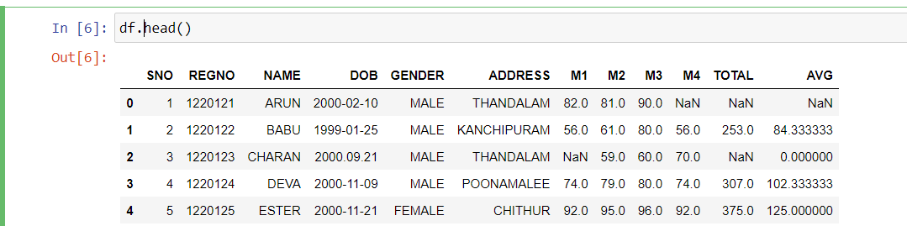

```
df.tail()
```
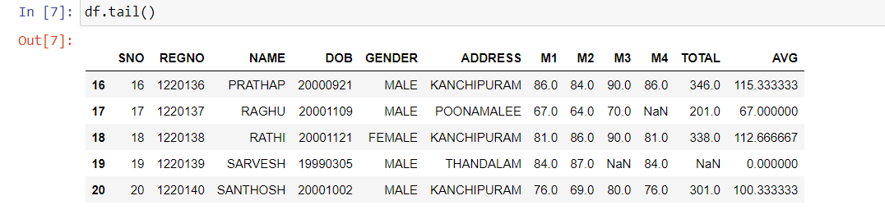
```
df.info()
```
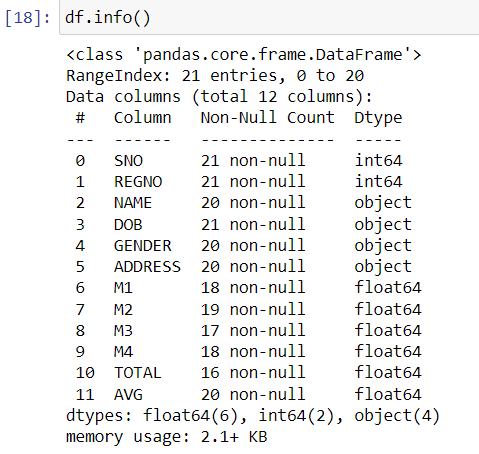
```
df.describe()
```
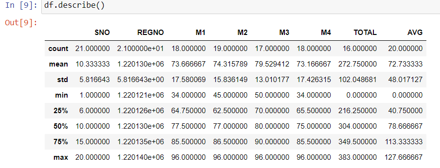
```
df.isnull()
```
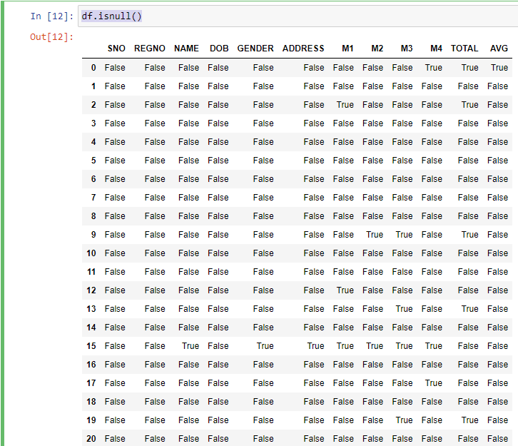
```
df.isnull().sum()
```
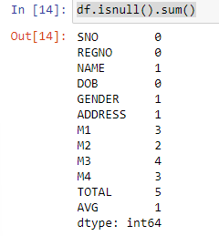
```
df.isnull().any()

```
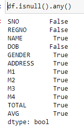
```
df.dropna()
```
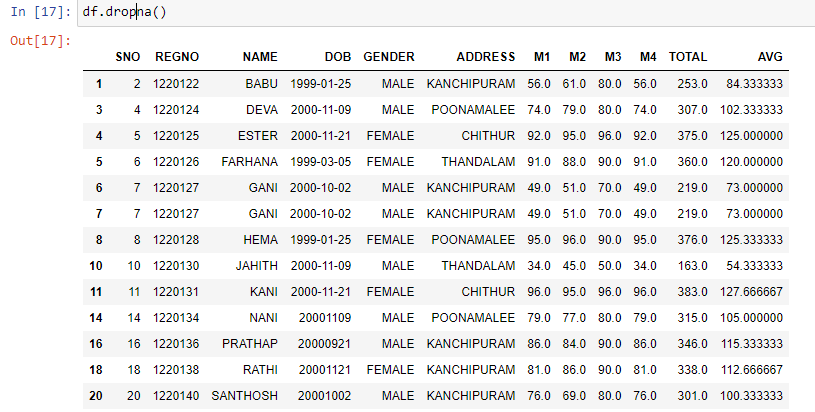
```
df.fillna(0)
```
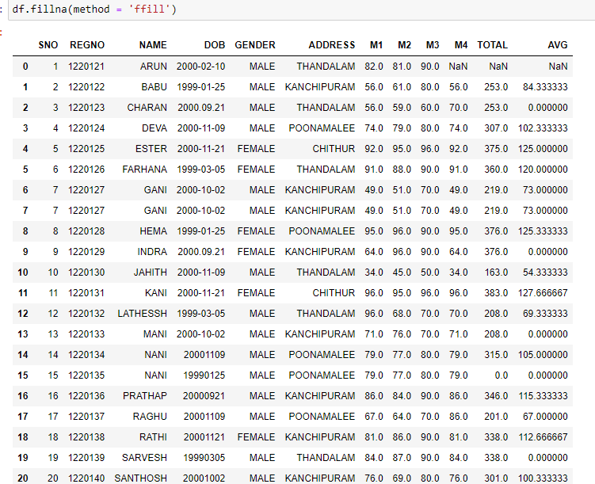

```
df.fillna(method = 'ffill')
```
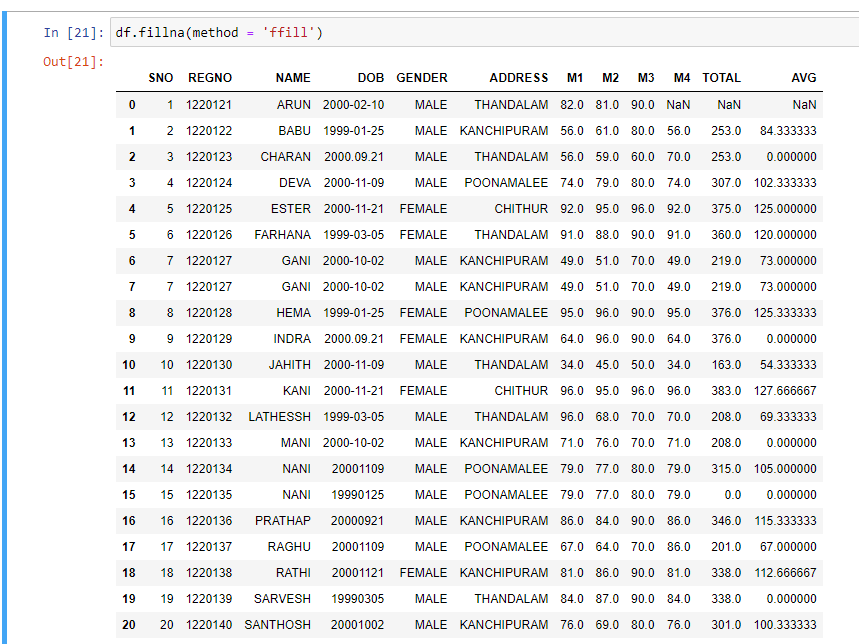
```
df.fillna(method = 'bfill')
```
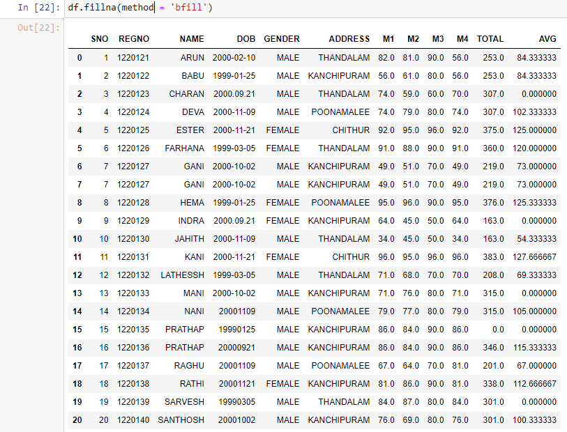
```
df['TOTAL'].fillna(value=df['TOTAL'].mean())
```
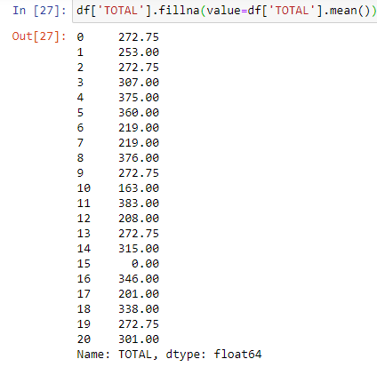
```
df_dropped = df.dropna()
df_dropped
```
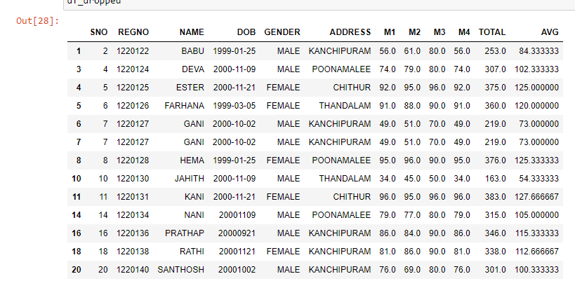
```
age = [1, 3, 28, 27, 25, 92, 30, 39, 40, 50, 26, 24, 29, 94]
af = pd.DataFrame(age, columns=['Age'])
af
```
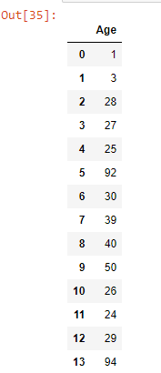
```
plt.figure(figsize=(8, 6))
plt.boxplot(af['Age'], vert=False)  # Use 'Age' instead of 'age'
plt.title('Boxplot of Age Data')
plt.xlabel('Age')
plt.grid(axis='x')
plt.show()
```
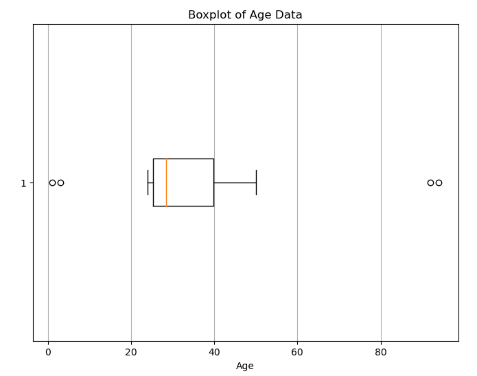
```
# Filter the DataFrame to remove outliers
af_no_outliers = af[(af['Age'] >= lower_bound) & (af['Age'] <= upper_bound)]

# Display the DataFrame without outliers
print("DataFrame without outliers:")
print(af_no_outliers)
```
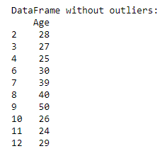
```
plt.figure(figsize=(8, 6))
plt.boxplot(af_no_outliers['Age'], vert=False)  # Set vert=False for horizontal boxplot
plt.title('Boxplot of Age Data (Outliers Removed)')
plt.xlabel('Age')
plt.grid(axis='x')
plt.show()
```
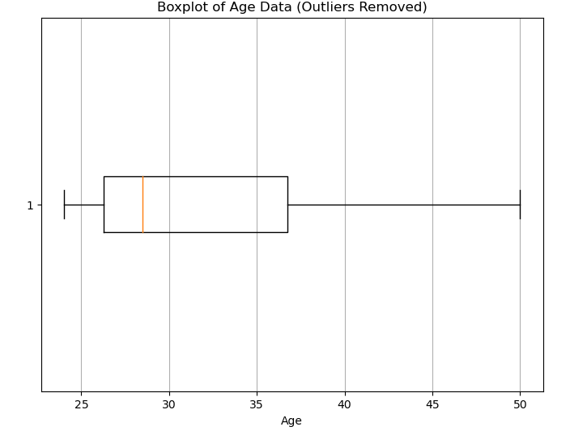
```
# Given data
data = [1, 12, 15, 18, 21, 24, 27, 30, 33, 36, 39, 42, 45, 48, 51, 54, 57, 60, 63, 66, 69, 72, 75, 78, 81, 84, 87, 90, 93, 96, 99, 158]
df = pd.DataFrame(data, columns=['Data'])

# Calculate Z-scores
z_scores = stats.zscore(df['Data'])

# Define a threshold for identifying outliers
threshold = 3

# Identify outliers based on Z-scores
outliers = df[np.abs(z_scores) > threshold]

# Display outliers
print("Outliers based on Z-score:")
print(outliers)
```
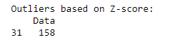
```
# Create a boxplot
plt.figure(figsize=(8, 6))
plt.boxplot(df['Data'], vert=False)  # Set vert=False for horizontal boxplot
plt.title('Boxplot of Data')
plt.xlabel('Data')
plt.grid(axis='x')
plt.show()
```
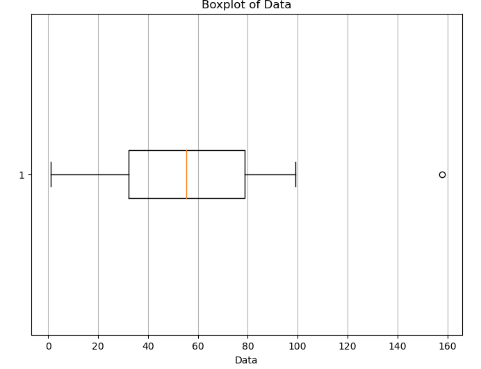
```
# Remove outliers from the DataFrame
df_no_outliers = df[np.abs(z_scores) <= threshold]

# Display the DataFrame without outliers
print("DataFrame without outliers:")
print(df_no_outliers)
```
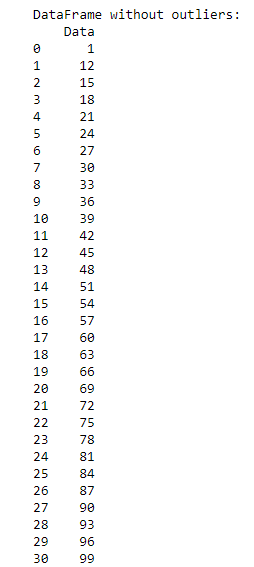
```
plt.subplot(1, 2, 2)
plt.boxplot(df_no_outliers['Data'], vert=False)
plt.title('Boxplot of Data (Outliers Removed)')
plt.xlabel('Data')
plt.grid(axis='x')

plt.tight_layout()
plt.show()
```
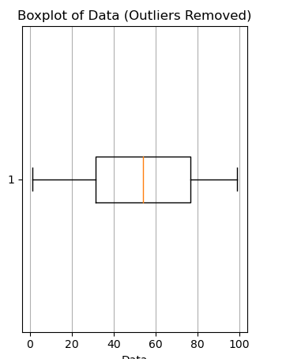
# Result
The data cleaning process has been done successfully 
